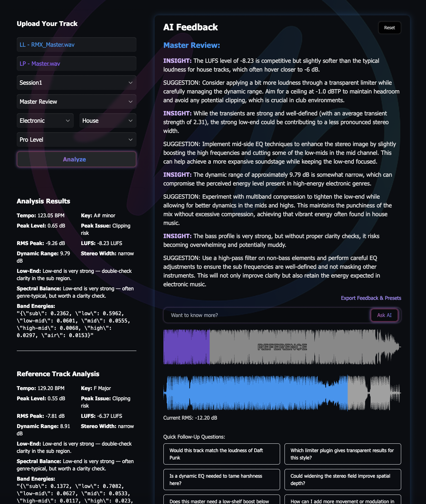
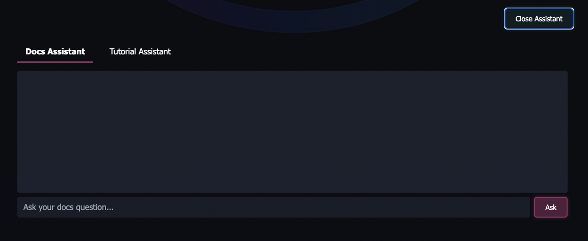

# ZoundZcope AI

Audio analysis + AI feedback for music producers. Upload a track, get precise technical analysis (LUFS, peaks, DR, transients, spectral balance), and receive genre‑aware mixdown/mastering guidance. Includes RAG docs assistants, multi‑track comparison, token usage tracking, and export to PDF.





---

## Table of Contents
- [Overview](#overview)
- [Key Features](#key-features)
- [Architecture](#architecture)
- [Directory Layout](#directory-layout)
- [Getting Started](#getting-started)
  - [Prerequisites](#prerequisites)
  - [Environment Variables](#environment-variables)
  - [Install & Run](#install--run)
- [Using the App](#using-the-app)
- [API Overview](#api-overview)
- [Audio Analysis Details](#audio-analysis-details)
- [RAG (Docs & Tutorials) Overview](#rag-docs--tutorials-overview)
- [Token Usage Tracking](#token-usage-tracking)
- [Background Cleanup Task](#background-cleanup-task)
- [Security Notes](#security-notes)
- [Troubleshooting](#troubleshooting)
- [Roadmap Ideas](#roadmap-ideas)
- [License](#license)

---

## Overview
ZoundZcope is a FastAPI application backed by a minimal UI (Tailwind + vanilla JS) that analyzes uploaded audio and generates structured, genre‑aware feedback using LLMs. It stores sessions, tracks, analysis results, and chat history, supports multi‑track comparisons, and offers a RAG assistant for project documentation and tutorials.

**Frontend pages**
- `/` — main interface (upload, analyze, AI feedback, reference track, follow‑ups, export)
- `/info.html` — docs, model comparison, token usage tables
- `/feedback_history.html` — manage sessions/tracks, view single‑track feedback, and generate multi‑track comparison feedback

**Static mounts**
- `/static` → frontend assets (CSS/JS/images)
- `/uploads` → user‑uploaded audio files (cleaned periodically)

---

## Tech Stack

|  | Tech | Purpose |
|---|---|---|
|  | **Python 3.10+** | Core language for backend & DSP utilities |
|  | **FastAPI** | API framework, routers, lifespan tasks, OpenAPI |
|  | **OpenAI API (GPT-4o Mini)** | AI feedback, follow-ups, comparisons, exports |
|  | **NumPy** | Numerical ops, STFT arrays, metrics plumbing |
|  | **SentenceTransformers** | Embeddings for RAG docs & tutorials |
|  | **FAISS (Meta)** | Vector index & similarity search |
|  | **SQLite** | Default persistent storage |
|  | **SQLAlchemy** | ORM for users/sessions/tracks/analysis/chat |
|  | **Tailwind CSS** | Lightweight styling for HTML templates |
|  | **Jinja2** | Server-rendered templates for the UI |


## Key Features
- **Upload & Analyze**: LUFS, true peak, RMS, dynamic range, tempo, key, transients, stereo width, frequency band energies, low‑end profile, spectral balance, peak‑issue detection.
- **Genre‑aware feedback**: Mixdown/Mastering/Master review modes with three communication profiles (simple/detailed/pro).
- **Reference track**: Compare your track to a reference track’s analysis.
- **Follow‑ups & summaries**: Ask follow‑up questions, auto/Manual summarize threads.
- **Multi‑track comparison**: Cohesion analysis across selected tracks with suggestions.
- **Token tracking**: Live usage panel, per‑stage breakdown, cost estimates.
- **Export**: Generate PDF containing AI feedback thread and preset recommendations.
- **RAG assistants**: Docs & Tutorial assistants using SentenceTransformers + FAISS.
- **Background hygiene**: Twice‑daily cleanup of old files in `/uploads`.

---

## Architecture
- **Backend**: FastAPI, SQLAlchemy, Jinja2, python‑dotenv, CORSMiddleware.
- **Audio**: `librosa`, `pyloudnorm`, `numpy` (FFT/STFT), tempo/key detection, transient analysis.
- **LLM**: OpenAI (primary). Hooks present for Groq/Google if enabled.
- **RAG**: `sentence-transformers` (all‑MiniLM‑L6‑v2), FAISS for similarity search.
- **Frontend**: Plain HTML templates + Tailwind CDN + WaveSurfer.js waveform UI + modular JS.

Routers registered:
- `/upload` (Upload)
- `/chat` (Chat + RAG)
- `/tokens` (Token usage)
- `/sessions` (CRUD for sessions)
- `/tracks` (Track operations)
- `/export` (PDF export)

> 📌 Explore interactive API docs at **`/docs`** (Swagger) and **`/redoc`** once the server is running.

---

## Directory Layout
```
repo/
├─ backend/
│  ├─ app/
│  │  ├─ main.py                 # FastAPI app, routes, CORS, static/templates
│  │  ├─ routers/
│  │  │  ├─ upload.py
│  │  │  ├─ chat.py
│  │  │  ├─ rag.py
│  │  │  ├─ tokens.py
│  │  │  ├─ sessions.py
│  │  │  └─ tracks.py
│  │  ├─ database.py             # SQLAlchemy Base/engine
│  │  ├─ models.py               # User/Session/Track/AnalysisResult/ChatMessage
│  │  ├─ analysis.py             # Audio analysis functions
│  │  ├─ feedback.py             # Prompt building + LLM calls
│  │  ├─ rag_utils.py            # Chunking/embeddings/FAISS helpers
│  │  ├─ token_tracker.py        # Token accounting helper
│  │  ├─ cleanup.py              # cleanup_old_uploads()
│  │  └─ utils.py                # Normalizers, token counters, etc.
│  └─ uploads/                   # Saved audio files (auto‑cleaned)
└─ frontend-html/
   ├─ templates/
   │  ├─ index.html
   │  ├─ info.html
   │  └─ feedback_history.html
   └─ static/
      ├─ style.css
      ├─ app.js
      ├─ waveform-logic.js
      ├─ dropdown-logic.js
      ├─ followup-logic.js
      ├─ followup-suggestions.js
      ├─ rag-assistant.js
      ├─ feedback_history.js
      └─ assets...
```

> The actual filenames may vary slightly; the tree above reflects the referenced modules and UI files.

---

## Getting Started

### Prerequisites
- **Python** 3.10+ recommended
- **FFmpeg** (for robust audio decoding)
- **libsndfile** (for `soundfile`/`librosa` under the hood)
- Build tools for some scientific packages

**macOS** (Homebrew)
```bash
brew install ffmpeg libsndfile
```

**Ubuntu/Debian**
```bash
sudo apt update
sudo apt install -y ffmpeg libsndfile1
```

### Environment Variables
Create a `.env` file in `backend/` (same folder you run Uvicorn from):
```env
# Required for AI feedback
OPENAI_API_KEY=sk-...

# Optional: enable alternates/providers if wired in your build
GROQ_API_KEY=...
GOOGLE_API_KEY=...
```

> The app will create the SQLite schema automatically on first run via `Base.metadata.create_all(...)`.

### Install & Run
```bash
# 1) Clone and enter the project
cd backend

# 2) (Recommended) Create a virtual environment
python -m venv .venv
source .venv/bin/activate  # Windows: .venv\Scripts\activate

# 3) Install dependencies
pip install --upgrade pip
pip install -r requirements.txt  # if present
# or install the core packages explicitly:
pip install fastapi uvicorn jinja2 python-dotenv SQLAlchemy             numpy librosa pyloudnorm sentence-transformers faiss-cpu             openai

# 4) Run the API
uvicorn app.main:app --reload --host 0.0.0.0 --port 8000
```
Open your browser:
- **http://localhost:8000/** — main UI
- **http://localhost:8000/info.html** — info page
- **http://localhost:8000/feedback_history.html** — feedback history & comparison
- **http://localhost:8000/docs** — API docs (Swagger)

> First run may download the `all-MiniLM-L6-v2` model for RAG.

---

## Using the App
1. **Upload your track** on `/`.
2. Choose **Session**, **Track Context** (mixdown/mastering/master), **Genre/Subgenre**, and **Feedback Profile** (simple/detailed/pro).
3. (Optional) Upload a **reference track** to compare.
4. Click **Analyze** to run audio analysis and get AI feedback.
5. Ask **follow‑up questions** or **summarize** the discussion.
6. **Export** AI feedback + preset recommendations to PDF.
7. See past analyses and run multi‑track comparisons on **/feedback_history.html**.

---

## API Overview
The app mounts several routers; explore details via **`/docs`**. Base paths include:

- **`/upload`** — upload audio files and kick off analysis
- **`/chat`** — AI feedback endpoints (initial + follow‑ups); RAG endpoints also live under this prefix
- **`/tokens`** — read/reset token usage counters
- **`/sessions`** — create/list/rename/delete sessions
- **`/tracks`** — track CRUD & retrieval per session
- **`/export`** — export feedback threads/presets to PDF

> Exact request/response bodies are visible in the OpenAPI schema. The HTML pages use these endpoints under the hood.

---

## Audio Analysis Details
The backend extracts many metrics from uploaded audio (mono‑downmixed for some calcs):

- **True Peak (dBFS)** — oversampled (up to 192 kHz) to catch inter‑sample peaks
- **Loudness (LUFS, RMS)** — ITU‑R BS.1770 via `pyloudnorm`; also crest factor & loudest‑section estimates
- **Dynamic Range** — crest factor around top‑loudness segments
- **Transients** — average/max onset strength with friendly descriptions
- **Tempo & Key** — beat tracking + chroma correlation (Krumhansl–Kessler profiles)
- **Stereo Width** — mid/side ratio with qualitative label (narrow/medium/wide)
- **Frequency Bands** — sub/low/low‑mid/mid/high‑mid/high/air ratios
- **Low‑End Profile** — genre‑aware guidance on bass/sub energy
- **Spectral Balance** — region aggregation with genre‑specific interpretation
- **Peak Issue Detection** — clipping/near‑clipping/low‑peak heuristics with explanations

All results are persisted and used to ground the AI’s feedback prompts.

---

## RAG (Docs & Tutorials) Overview
- Text is split into chunks, embedded with **SentenceTransformers (all‑MiniLM‑L6‑v2)**, and indexed via **FAISS**.
- Simple helpers are provided to **build/save/load** indexes and associated metadata.
- The UI exposes two assistants (Docs / Tutorial) on the main page (toggle button). These hit backend RAG endpoints under `/chat`.

> First use will download the embedding model; ensure the host has internet access for that initial step.

---

## Token Usage Tracking
The app tracks token usage per request and surfaces live stats on the **info page**. Costs shown there are estimates using **OpenAI GPT‑4o Mini** rates and the measured prompt/response token split.

A small `/tokens` router provides endpoints to read and reset counters.

---

## Background Cleanup Task
A periodic task runs **every 12 hours** to remove stale files in `/uploads`:
- Started in the FastAPI **lifespan** context and again at **startup** as a safety net
- Uses `cleanup_old_uploads()`; adjust retention policy there as needed

> Logs are emitted via the `uvicorn.error` logger.

---

## Security Notes
- **CORS** is currently set to `allow_origins=["*"]`. Lock this down for production.
- Uploaded files are **served back** from `/uploads`. If exposing publicly, add authentication/tenancy rules.
- API keys are loaded from `.env`. Do **not** commit secrets.

---

## Troubleshooting
- **Librosa / soundfile errors**: ensure `ffmpeg` and `libsndfile` are installed (see prerequisites).
- **FAISS install issues**: use `faiss-cpu` on most hosts. For GPU builds, follow FAISS docs for your CUDA version.
- **Model downloads blocked**: the SentenceTransformers model requires outbound internet on first run.
- **OpenAI errors**: verify `OPENAI_API_KEY` in environment and that the account has access/credits.
- **Waveform not showing**: confirm the uploaded file is accessible under `/uploads` and WaveSurfer script is loaded.
- **CORS blocks**: tighten/adjust CORS settings in `main.py` for your deployment domain(s).

---

## Roadmap Ideas
- Configurable **retention policy** for uploads (age/size limits)
- Optional **auth** + per‑user namespaces for sessions/uploads
- Pluggable **model providers** (toggle OpenAI/Groq/Google at runtime)
- **Preset generator** refinement with real device/rack exports
- Expand RAG tooling (drag‑and‑drop docs, multi‑file indexing from UI)

---

## License
This project is currently **unlicensed** and **all rights are reserved**. If you want to collaborate or use this code, please reach out and ask.
